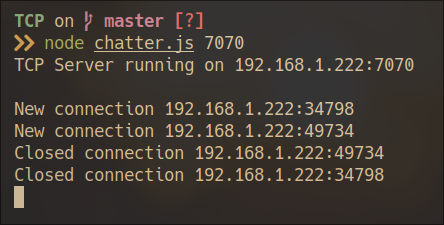
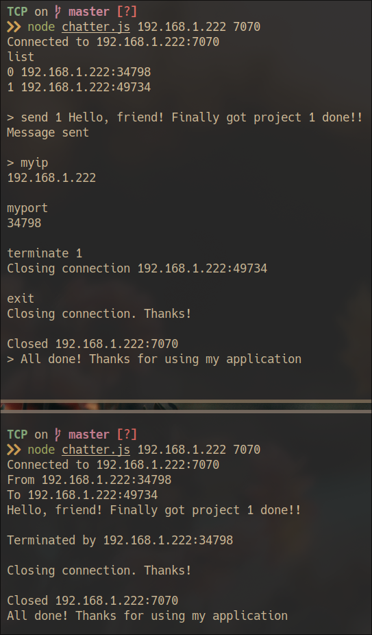
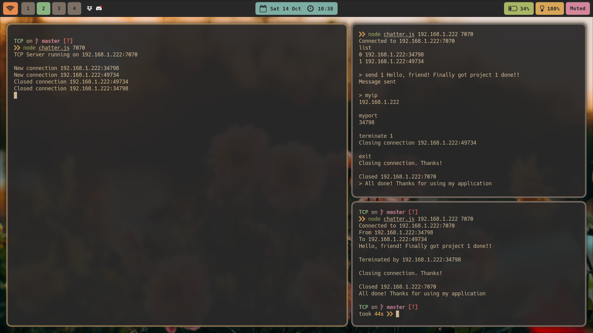

# CS 4470 Assignment 1

## A Chat Application for Remote Message Exchange

### Group 8: Erica Payne & Youssef El-zein

### Contributions of each member

-   We used JavaScript and NodeJs (only net and os modules were used)
-   We each split up the work evenly and figured out how to implement everything together and coheasively. We both had a base code to start with and decided how to do our implementations
-   Most of the work was done in the server.js to make sure that the server was handling most of the interactions between the clients.

-   `Erica`

    -   Wrote functions in the program:
        -   Made the listConnections function to make sure that the sockets connected were added to a list to later show the client using the command 'list'.
        -   Wrote the handling input switch method that takes the first line of the data entered and runs the function according to what was entered.
        -   Took on displayOptions adding a help menu when help is typed into the console, showing all available commands and uses of the program.
        -   Wrote myip and myport which was just returning the ip address and port no.
    -   Worked on reading the lines put in to the console and splitting the input into 3 different arguments in order to take each as a different parameter for certain functions.

-   `Youssef`
    -   Wrote functions used in the program:
        -   sendMessage (which enables sending messages using the socket, the socket id and the message they want to send) and also includes the createMessage function which gets the message ready to be sent
        -   terminateConnection where it takes the parameters of the socket and the socket index you want to terminate and allows it to close or returns an error message if the socket index isnt right or out of bounds.
    -   Decided the use of asynchronous functions to make ensure you are able to run specific functions at specific times instead of things happening at the same time.
    -   Figured the use of os.networkInterfaces() to show the actual IP address when we were onnly getting the local address of the sockets

### How to Use

-   The only pre-requisite is [NodeJs](https://nodejs.org/en)
-   Either clone this repository or download the zip and unzip it
-   Both server and client are started through chatter.js based on the number of arguments it's given:
    -   Call chatter.js with just a port to start server.js
    -   Call chatter.js with an IP and port to start client.js and connect to the TCP server
-   Note: the server is set up to automatically run on the public ip (inet). This is done using "os.networkInterfaces()" and we assume a network interface with name "wlan0" exists on the system too. Check to confirm your machine's network interface also matches by using "ifconfig" and update line 5 in server.js accordingly if it does not match

### Screenshots

